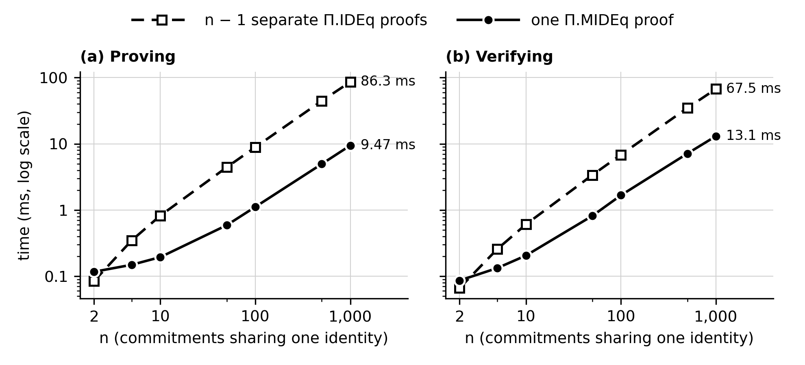
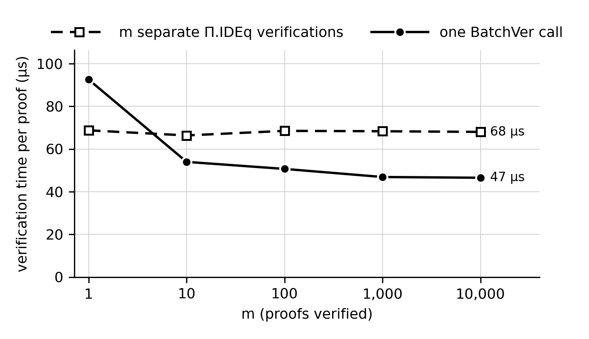

# Benchmark results

Generated by `scripts/report.py` from one `cargo bench` run plus the size and FAR/FRR tests. Every number below comes from the files in this folder. How to read them: `guide-benchmark/01-targets.md` (expected shapes) and `guide-benchmark/07-reporting.md`.

## Run

| | |
|---|---|
| Date | 2026-09-27 01:13 |
| Git commit | 7a337a6 |
| CPU | AMD Ryzen 7 6800H with Radeon Graphics |
| Cores / threads | 8 / 16 |
| RAM | 15 GB |
| OS | Microsoft Windows 11 Home Single Language (build 26200) |
| Power | on AC |
| Power plan | Turbo |
| Maximum processor state (AC) | 99 % |
| rustc | rustc 1.95.0 (59807616e 2026-04-14) |
| criterion | 0.5.1 |
| Criterion data written | 2026-09-27 01:03 to 2026-09-27 01:11 |

## Basic method — metric targets (proposal Table 3.1; commit time from the RTM)

Table 3.1 was written for the Basic method: the commitment, Π.IDEq and Π.VVer.

| Metric | Target | Measured | Pass |
|---|---|---|---|
| Commitment generation time | < 10 ms | 0.0835 ms | ✓ |
| Proof generation time | < 10 ms | 0.0818 ms (slowest: Π.IDEq) | ✓ |
| Verification time | < 5 ms | 0.0617 ms (slowest: Π.VVer) | ✓ |
| Throughput (transactions verified per second, one core) | > 100 TPS | 8,275 (Π.IDEq + Π.VVer per transaction) | ✓ |
| Commitment size | 32–64 B | 32 B | ✓ |
| Communication complexity | O(log p) | Π.IDEq 96 B, Π.VVer 96 B: a fixed number of 32-byte elements | ✓ |
| Soundness error | ≤ 1/p | analytical: Theorems 1–2 (a factor Q in the random-oracle model) | — |
| False approval rate | 0 | 0 / 60,000 adversarial runs | ✓ |
| False rejection rate | 0 | 0 / 20,000 honest runs | ✓ |

## Advanced method — the spec's own claims

No document sets numeric targets for the Advanced method; Table 3.1 predates it. Its criteria are the claims of `proposed-method-advanced.docx` (§1: what each protocol adds; §5: BatchVer; §6: cost summary) and the comparisons of `IBC_Basic_Advanced.docx` §D.5 (tasks a–d), each measured against the Basic method, plus Table 3.1's per-proof targets.

| Protocol | Criterion (source) | Measured | Pass |
|---|---|---|---|
| Π.MIDEq | one 96 B proof for any n, against 96(n − 1) B for n − 1 Π.IDEq proofs (§6; task b) | 96 B at n = 2, 10 and 100 | ✓ |
| Π.MIDEq | cheaper than n − 1 Π.IDEq proofs: 2 exponentiations + O(n) scalar work against 4(n − 1) exponentiations (§6; task b) | cheaper from n = 5: 2.3× less time to prove, 1.9× to verify; at n = 1,000: 9.1× and 5.2×. At n = 2 (one Π.IDEq replaced, nothing to aggregate) it takes 1.39× / 1.30× the time | ✓ (n ≥ 5) |
| Π.TxVer | the same size as the two separate proofs (§6) | 192 B = 96 + 96 B | ✓ |
| Π.TxVer | no overhead against Π.IDEq + Π.VVer: 1 hash, 1 challenge, one MSM of 7 bases instead of 2, 2 and 2 checks (§6; task d) | prove 0.89×, verify 0.97× the pair's time | ✓ |
| Π.TxVer | inseparable: a proof with either clause false is rejected (§1, §6) | 0 / 10,000 such proofs accepted | ✓ |
| Π.VEq | two hidden values shown equal in 96 B — not expressible in Basic (§1, §6) | 96 B; 0 wrong verdicts in 40,000 runs | ✓ |
| Π.FullEq | a re-randomisation shown in 64 B — not expressible in Basic (§1, §6) | 64 B; 0 wrong verdicts in 40,000 runs | ✓ |
| BatchVer | cost per proof falls with m, below m separate checks: one MSM of 2m + 2 bases (§5, §6; task c) | 93 → 47 µs per proof as m grows to 10,000, while one-by-one stays 66–69 µs; faster from m = 10 (1.23×), 1.46× at m = 10,000; a batch of 1 is slower (0.74×) | ✓ (m ≥ 10) |
| BatchVer | a batch hiding one bad proof is rejected (Theorem 6) | 0 / 10,000 accepted | ✓ |
| all four proofs | Table 3.1's per-proof targets: prove < 10 ms, verify < 5 ms | slowest 0.175 ms (Π.MIDEq, n = 10) / 0.198 ms (Π.MIDEq, n = 10) | ✓ |
| Π.TxVer | Table 3.1's throughput: > 100 transactions verified per second | 8,511; end to end (commit + prove + verify) 2,900 | ✓ |
| all | soundness error: 1/p (Π.VEq, Π.TxVer), 2/p (Π.MIDEq), 2^−ℓ (BatchVer) (§6) | analytical: Theorems 3–6 (a factor Q in the random-oracle model; ≈ Q/p for the hash-derived batch weights) | — |

## Per protocol (task a) — mean ± standard deviation, µs

| Method | Protocol | Prove | Verify | Proof size |
|---|---|---|---|---|
| Basic | Π.IDEq | 82 ± 2 | 60 ± 3 | 96 B |
| Basic | Π.VVer | 78 ± 1 | 62 ± 1 | 96 B |
| Advanced | Π.VEq | 83 ± 3 | 61 ± 2 | 96 B |
| Advanced | Π.FullEq | 54 ± 1 | 54 ± 1 | 64 B |
| Advanced | Π.TxVer | 141 ± 2 | 117 ± 1 | 192 B |
| Advanced | Π.MIDEq, n = 10 | 175 ± 3 | 198 ± 7 | 96 B |
| both | Commit | 83 ± 4 | | 32 B (commitment) |

Mean ± standard deviation of criterion's samples (`new/estimates.json`), as Bab 3 asks. The line criterion prints in the terminal shows a different estimator (a regression slope), so its middle number can differ — most where the machine was noisy, which a large ± also shows.

## Π.TxVer vs two separate proofs (task d) — µs

| | Π.IDEq + Π.VVer | Π.TxVer | pair ÷ Π.TxVer |
|---|---|---|---|
| Prove | 158 ± 2 | 141 ± 2 | 1.12× |
| Verify | 121 ± 1 | 117 ± 1 | 1.03× |

## Chart 1 — Π.MIDEq vs n − 1 Π.IDEq (task b)



At n = 1,000: proving 9.47 ms vs 86.3 ms (9.1× less), verifying 13.1 ms vs 67.5 ms (5.2× less). At n = 2, Π.MIDEq is 1.30× the time of the single Π.IDEq to verify. Proof size: 96 B for every n, against 96(n − 1) B.

Verification passes 5 ms at n ≈ 344 for Π.MIDEq and at n ≈ 73 for the separate proofs (linear interpolation between measured points).

Numbers: [mideq_vs_ideq.csv](mideq_vs_ideq.csv) · chart: [SVG](chart1_mideq_vs_ideq.svg), [PNG](chart1_mideq_vs_ideq.png)

## Chart 2 — BatchVer vs individual verification (task c)



Per proof at m = 10,000: 47 µs in one batch vs 68 µs verified one by one (1.46× faster). At m = 1 the batch takes 93 µs vs 69 µs.

Numbers: [batchver_vs_individual.csv](batchver_vs_individual.csv) · chart: [SVG](chart2_batchver_vs_individual.svg), [PNG](chart2_batchver_vs_individual.png)

## Proof sizes (task a)

```
commitment 32  ideq 96  vver 96  veq 96  fulleq 64  mideq 96  txver 192
```

## False approval / rejection rates

```
FAR / FRR over 10000 fresh runs per scenario

protocol        scenario                        accepted   errors
IDEq            honest                     10000 / 10000    0 false rejections
IDEq            false statement                0 / 10000    0 false approvals
IDEq            replayed to another ctx        0 / 10000    0 false approvals
IDEq            tampered response              0 / 10000    0 false approvals
VVer            honest                     10000 / 10000    0 false rejections
VVer            false statement                0 / 10000    0 false approvals
VVer            replayed to another ctx        0 / 10000    0 false approvals
VVer            tampered response              0 / 10000    0 false approvals
VEq             honest                     10000 / 10000    0 false rejections
VEq             false statement                0 / 10000    0 false approvals
VEq             replayed to another ctx        0 / 10000    0 false approvals
VEq             tampered response              0 / 10000    0 false approvals
FullEq          honest                     10000 / 10000    0 false rejections
FullEq          false statement                0 / 10000    0 false approvals
FullEq          replayed to another ctx        0 / 10000    0 false approvals
FullEq          tampered response              0 / 10000    0 false approvals
TxVer           honest                     10000 / 10000    0 false rejections
TxVer           false statement                0 / 10000    0 false approvals
TxVer           replayed to another ctx        0 / 10000    0 false approvals
TxVer           tampered response              0 / 10000    0 false approvals
MIDEq (n=5)     honest                     10000 / 10000    0 false rejections
MIDEq (n=5)     false statement                0 / 10000    0 false approvals
MIDEq (n=5)     replayed to another ctx        0 / 10000    0 false approvals
MIDEq (n=5)     tampered response              0 / 10000    0 false approvals
BatchVer (m=8)  honest batch               10000 / 10000    0 false rejections
BatchVer (m=8)  one false proof in 8           0 / 10000    0 false approvals

0 errors in 10000 runs => that rate is below 3/10000 = 0.030 % (95 % confidence)
```
